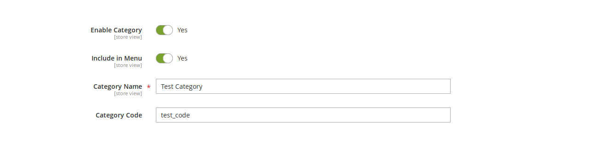
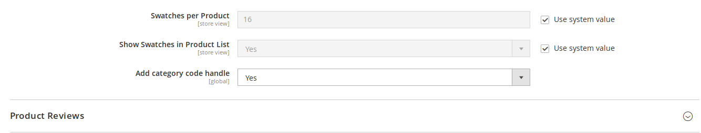

# Category Code extension for Magento 2

---

## User Guide

---

<!-- START doctoc generated TOC please keep comment here to allow auto update -->
<!-- DON'T EDIT THIS SECTION, INSTEAD RE-RUN doctoc TO UPDATE -->
<!-- END doctoc generated TOC please keep comment here to allow auto update -->

### Description

`Okaeli_CategoryCode` is a Magento 2 extension that will add a "code" attribute to categories.

The main purpose of this is to have a unique identifier to manage categories (better than `id` that could be dependent on the environment).

In addition, this extension can add a new handle in the category page layout depending on this unique identifier. This should be used to put the design of a
specific category in your Version Control System tool (e.g by modifying a xml file) instead of doing that in the `Layout Update XML` backend field. 

### Usage

#### Features

1. If you have to load a specific category, you should use the `Okaeli\CategoryCode\Helper\Data::getCategoryByCode` method.
   As the code is unique and does not depend on the environment, you are sure to retrieve the wanted category. This would not be the case if
   you were using the `id` or even worse, the `name` ...

2. If you need to update layout of a category and do not want to do it in the backend, you should use the handle
   `catalog_category_code_here_the_code_of_the_category`

For example, suppose that you need to remove the title of the category page **only** for the category having the code `modify_me`.
Then, you could create a `catalog_category_code_modify_me.xml` in the `app/design/frontend/MyCompany/MyTheme/Magento_Catalog/layout` folder with the following content :

    <?xml version="1.0"?>
    <page xmlns:xsi="http://www.w3.org/2001/XMLSchema-instance" xsi:noNamespaceSchemaLocation="urn:magento:framework:View/Layout/etc/page_configuration.xsd">
        <body>
            <referenceBlock name="page.main.title" remove="true"/>
        </body>
    </page>

#### Configurations

This module comes with one configuration :

* `Stores > Configuration > Catalog > Catalog > Storefront > Add category code handle`

This configuration allows you to enable / disable frontend layout update. If `Yes` is selected,
a new handle depending on the category code (e.g `catalog_category_code_` concatenated with the category code in 
lowercase) will be added to other available handles.

